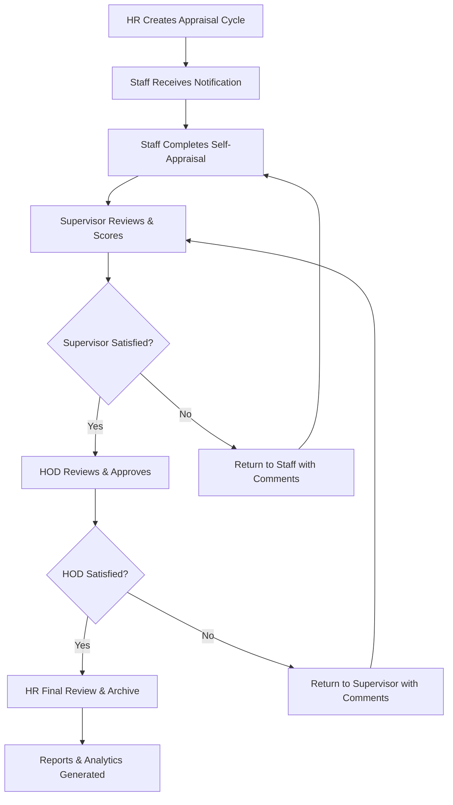
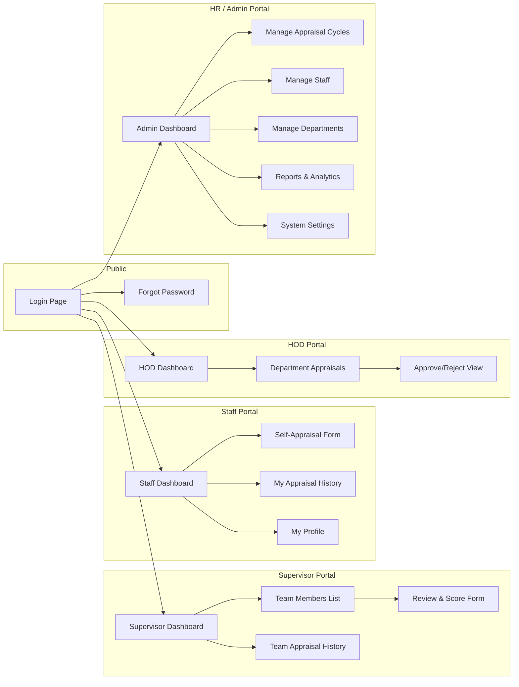
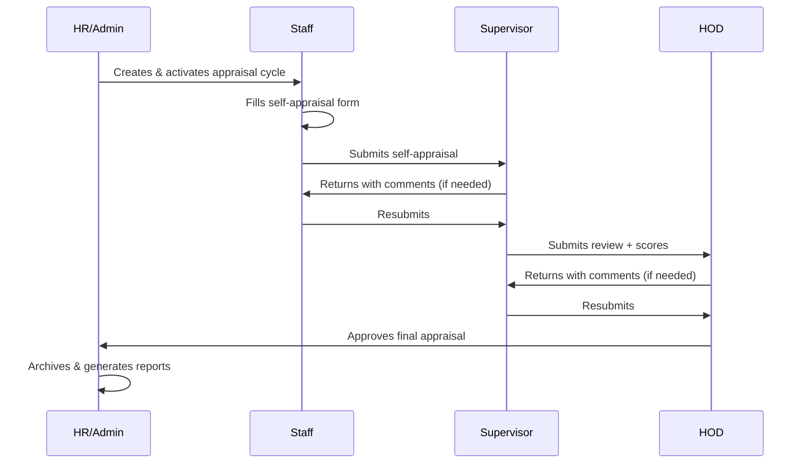

# Staff Performance Appraisal System — State Internal Revenue Service

## Overview

A web-based staff performance appraisal system that enables the State Internal Revenue Service to evaluate employee performance through a structured, multi-level review process. The system supports **self-assessment**, **supervisor review**, **department head approval**, and **HR/Admin oversight**.

**Tech Stack**: HTML, Tailwind CSS, Alpine.js (lightweight reactivity), Chart.js (dashboards), LocalStorage/JSON (Phase 1 data persistence — upgradeable to a backend later).

---

## User Roles

| Role | Description |
|------|-------------|
| **Staff** | Regular employee — submits self-appraisal |
| **Supervisor** | Direct manager — reviews and scores subordinates |
| **HOD** (Head of Department) | Department head — approves/reviews departmental appraisals |
| **HR/Admin** | Human Resources — manages cycles, views reports, system config |

---

## System Flow (How Appraisals Move)



---

## Page Map & Navigation Structure



---

## Detailed Page Descriptions

---

### 1. Login Page (`login.html`)

> **Purpose**: Single entry point for all users.

| Element | Detail |
|---------|--------|
| Staff ID / Email field | Text input |
| Password field | Password input |
| "Forgot Password" link | Navigates to `forgot-password.html` |
| Login button | Authenticates and redirects based on role |
| Role indicator | Shown after login or auto-detected from credentials |

**Behavior**:
- On successful login → redirect to the appropriate **role-based dashboard**
- Invalid credentials → inline error message
- Session stored in LocalStorage (Phase 1) / JWT token (Phase 2)

**Connects to**: Staff Dashboard, Supervisor Dashboard, HOD Dashboard, or Admin Dashboard (based on role)

---

### 2. Forgot Password Page (`forgot-password.html`)

> **Purpose**: Password recovery flow.

- Input: Staff ID or Email
- Action: Displays a confirmation message (Phase 1: placeholder; Phase 2: actual email)
- **Connects back to**: Login Page

---

### 3. Staff Dashboard (`staff/dashboard.html`)

> **Purpose**: Staff landing page after login — shows appraisal status at a glance.

| Section | Content |
|---------|---------|
| **Welcome Banner** | "Hello, [Name]" + current appraisal cycle info |
| **Appraisal Status Card** | Status badge: `Not Started` / `In Progress` / `Submitted` / `Reviewed` / `Approved` |
| **Action Button** | "Start Self-Appraisal" or "View Submitted Appraisal" depending on status |
| **Notifications Panel** | Messages from supervisor (e.g., "Returned for revision", "Approved") |
| **Quick Stats** | Previous appraisal score, current cycle deadline |

**Navigation Sidebar**:
- Dashboard (active)
- Self-Appraisal Form
- Appraisal History
- My Profile
- Logout

**Connects to**: Self-Appraisal Form, Appraisal History, Profile

---

### 4. Self-Appraisal Form (`staff/self-appraisal.html`)

> **Purpose**: Staff fills in their performance self-assessment for the current cycle.

| Section | Fields |
|---------|--------|
| **KPI / Performance Targets** | Table with: KPI Description, Target, Achievement, Self-Score (1-5), Evidence/Comments |
| **Core Competencies** | Rated items: Teamwork, Communication, Initiative, Punctuality, Technical Skills — each with self-rating (1-5) + comment |
| **Key Achievements** | Free-text textarea — bullet points of accomplishments |
| **Challenges Faced** | Free-text textarea |
| **Training Needs** | Multi-select or free text for desired training |
| **Goals for Next Period** | Free-text or structured list |
| **Overall Self-Rating** | Auto-calculated from KPI + Competency scores |

**Buttons**:
- `Save as Draft` — saves progress, can return later
- `Submit for Review` — locks the form and sends to supervisor

**Behavior**:
- If status is `Returned`, the form is editable with supervisor's comments shown inline
- If status is `Submitted` or beyond, the form is read-only
- Validation: all required fields must be filled before submission

**Connects to**: Staff Dashboard (back), Supervisor's review queue (on submit)

---

### 5. Appraisal History (`staff/history.html`)

> **Purpose**: View past appraisal records across all cycles.

| Column | Data |
|--------|------|
| Appraisal Cycle | e.g., "2025 Annual Review" |
| Date Submitted | Date |
| Self-Score | Number |
| Supervisor Score | Number |
| Final Score | Number |
| Status | Badge |
| Action | "View Details" button |

**Connects to**: Read-only view of any past appraisal form

---

### 6. My Profile (`staff/profile.html`)

> **Purpose**: View and edit personal information.

- Fields: Full Name, Staff ID (read-only), Department (read-only), Designation, Email, Phone
- Change Password section
- **Connects to**: Dashboard (back)

---

### 7. Supervisor Dashboard (`supervisor/dashboard.html`)

> **Purpose**: Overview of team appraisal progress.

| Section | Content |
|---------|---------|
| **Cycle Overview** | Current cycle name, deadline, progress bar |
| **Team Progress Cards** | Count of: Pending Self-Appraisal, Awaiting Your Review, Reviewed, Returned |
| **Pending Reviews Table** | List of staff who have submitted — with "Review" action button |
| **Notifications** | HOD returns, new submissions |

**Connects to**: Team Members List, Review Form, Team History

---

### 8. Team Members List (`supervisor/team.html`)

> **Purpose**: Full list of direct reports with their current appraisal status.

| Column | Data |
|--------|------|
| Staff Name | Name |
| Staff ID | ID |
| Designation | Title |
| Appraisal Status | Badge |
| Action | "Review" / "View" button |

**Connects to**: Review & Score Form (for pending), Read-only view (for completed)

---

### 9. Supervisor Review & Score Form (`supervisor/review.html`)

> **Purpose**: Supervisor reviews staff self-appraisal and adds their own scores.

| Section | Detail |
|---------|--------|
| **Staff Info Header** | Name, ID, Department, Designation |
| **KPI Review Table** | Shows staff's self-score alongside supervisor's score column (1-5) + supervisor comments per KPI |
| **Competency Review** | Same side-by-side layout for each competency |
| **Staff's Achievements** | Read-only display of what staff wrote |
| **Supervisor's Overall Comments** | Free-text textarea |
| **Recommendation** | Dropdown: Excellent / Very Good / Good / Fair / Poor |
| **Supervisor Overall Score** | Auto-calculated |

**Buttons**:
- `Return to Staff` — sends back with comments for revision
- `Submit to HOD` — forwards for department head approval

**Connects to**: Supervisor Dashboard (back), HOD's approval queue (on submit), Staff form (on return)

---

### 10. HOD Dashboard (`hod/dashboard.html`)

> **Purpose**: Department-level overview of all appraisals.

| Section | Content |
|---------|---------|
| **Department Stats** | Total staff, completed reviews, pending approvals |
| **Pending Approvals Table** | Staff who have been reviewed by supervisor — awaiting HOD action |
| **Department Performance Chart** | Bar/pie chart of score distribution |

**Connects to**: Department Appraisals List, Approve/Reject View

---

### 11. Department Appraisals List (`hod/appraisals.html`)

> **Purpose**: Full list of department appraisals with filters.

- Filter by: Status, Unit, Score Range
- Sortable columns
- **Connects to**: Approve/Reject View for each entry

---

### 12. HOD Approve/Reject View (`hod/review.html`)

> **Purpose**: HOD reviews the full appraisal (staff + supervisor) and makes final departmental decision.

| Section | Detail |
|---------|--------|
| **Full Appraisal View** | Read-only view of staff self-appraisal + supervisor review |
| **Score Comparison** | Side-by-side: Self-Score vs Supervisor Score |
| **HOD Comments** | Free-text textarea |
| **Action** | `Approve` / `Return to Supervisor` with comments |

**Connects to**: HOD Dashboard (back), HR queue (on approve), Supervisor (on return)

---

### 13. Admin/HR Dashboard (`admin/dashboard.html`)

> **Purpose**: System-wide overview and management hub.

| Section | Content |
|---------|---------|
| **Organization Stats** | Total staff, active cycle, completion rate |
| **Completion Progress** | Donut chart — Not Started / In Progress / Completed |
| **Department Breakdown** | Table of departments with completion percentages |
| **Recent Activity Feed** | Timeline of recent submissions and approvals |
| **Quick Actions** | Create New Cycle, Generate Report, Add Staff |

**Connects to**: All admin sub-pages

---

### 14. Manage Appraisal Cycles (`admin/cycles.html`)

> **Purpose**: Create, edit, and manage appraisal periods.

| Field | Detail |
|-------|--------|
| Cycle Name | e.g., "2025 Q3 Appraisal" |
| Start Date | Date picker |
| End Date | Date picker |
| Status | Draft / Active / Closed |
| KPI Template | Select or customize KPI categories for this cycle |

**Actions**: Create New, Edit, Activate, Close, Delete Draft

---

### 15. Manage Staff (`admin/staff.html`)

> **Purpose**: Staff directory and role management.

| Column | Data |
|--------|------|
| Name | Full name |
| Staff ID | Unique ID |
| Department | Department name |
| Designation | Job title |
| Role | Staff / Supervisor / HOD |
| Supervisor | Assigned supervisor |
| Action | Edit / Deactivate |

**Actions**: Add Staff, Bulk Import (CSV), Edit, Assign Roles, Assign to Supervisor

---

### 16. Manage Departments (`admin/departments.html`)

> **Purpose**: Create and manage organizational departments/units.

- Add/Edit/Delete departments
- Assign HOD to each department
- View staff count per department

---

### 17. Reports & Analytics (`admin/reports.html`)

> **Purpose**: Generate and view performance reports.

| Report Type | Description |
|-------------|-------------|
| **Individual Report** | Full appraisal report for a selected staff member |
| **Department Summary** | Aggregated scores and ratings by department |
| **Organization Overview** | Cross-department comparison |
| **Score Distribution** | Histogram of final scores |
| **Completion Status** | Cycle progress across the organization |

**Features**: 
- Filter by cycle, department, score range
- Export to PDF / Excel (Phase 2)
- Charts powered by Chart.js

---

### 18. System Settings (`admin/settings.html`)

> **Purpose**: Configure system-wide parameters.

- Scoring scale (1-5 or 1-10)
- Competency categories (add/remove/edit)
- KPI templates
- Notification messages
- Organization name and logo

---

## Data Flow Summary



---

## File & Folder Structure

```
appraisal_system/
├── index.html                  ← Login page
├── forgot-password.html
├── css/
│   └── styles.css              ← Custom styles (Tailwind via CDN)
├── js/
│   ├── app.js                  ← Shared utilities, auth, navigation
│   ├── auth.js                 ← Login/logout/session management
│   ├── data.js                 ← LocalStorage CRUD helpers
│   └── charts.js               ← Chart.js configurations
├── staff/
│   ├── dashboard.html
│   ├── self-appraisal.html
│   ├── history.html
│   └── profile.html
├── supervisor/
│   ├── dashboard.html
│   ├── team.html
│   └── review.html
├── hod/
│   ├── dashboard.html
│   ├── appraisals.html
│   └── review.html
├── admin/
│   ├── dashboard.html
│   ├── cycles.html
│   ├── staff.html
│   ├── departments.html
│   ├── reports.html
│   └── settings.html
└── components/
    ├── sidebar.html            ← Reusable sidebar (loaded via JS)
    ├── header.html             ← Reusable top bar
    └── notifications.html      ← Notification dropdown
```

---

## Phased Delivery Plan

### Phase 1 — MVP (Current Build)
- [x] Login system with role-based routing
- [x] Staff self-appraisal form (submit + draft)
- [x] Supervisor review & scoring
- [x] HOD approval flow
- [x] Admin dashboard with cycle management
- [x] Data stored in LocalStorage/JSON
- [x] Tailwind CSS + Alpine.js + Chart.js

### Phase 2 — Enhancements
- [ ] Backend API (Node.js/Express or PHP)
- [ ] Database (MySQL or PostgreSQL)
- [ ] Email notifications
- [ ] PDF report generation
- [ ] Bulk staff import (CSV)
- [ ] Audit trail / activity logs

### Phase 3 — Advanced
- [ ] 360-degree feedback
- [ ] Goal tracking with mid-year reviews
- [ ] Mobile-responsive PWA
- [ ] Role-based access control (RBAC) with permissions
- [ ] Integration with payroll systems

---

## Open Questions

> [!IMPORTANT]
> Please clarify the following before we begin building:

1. **Scoring Scale**: Should the appraisal use a **1–5** or **1–10** scoring scale?
2. **KPI Categories**: Do you have a predefined list of KPIs/competencies used by the Revenue Service, or should we create generic ones?
3. **Appraisal Frequency**: Is this **annual**, **bi-annual**, or **quarterly**?
4. **Seed Data**: Should I pre-populate the system with sample staff, departments, and a demo appraisal cycle for testing?
5. **Tailwind Version**: You mentioned Tailwind CSS — shall I use **Tailwind v3 via CDN** (simplest) or set up a build tool?
6. **Authentication**: For Phase 1, is a simple hardcoded login (demo accounts per role) acceptable, or do you need a registration flow?

---

## Verification Plan

### Automated Tests
- Form validation tested via browser console scripts
- Navigation flow verified by clicking through all links

### Manual Verification
- Walk through the complete appraisal lifecycle: HR creates cycle → Staff submits → Supervisor reviews → HOD approves → HR views report
- Test on both desktop and mobile viewports
- Verify all role-based access (each role only sees their pages)
